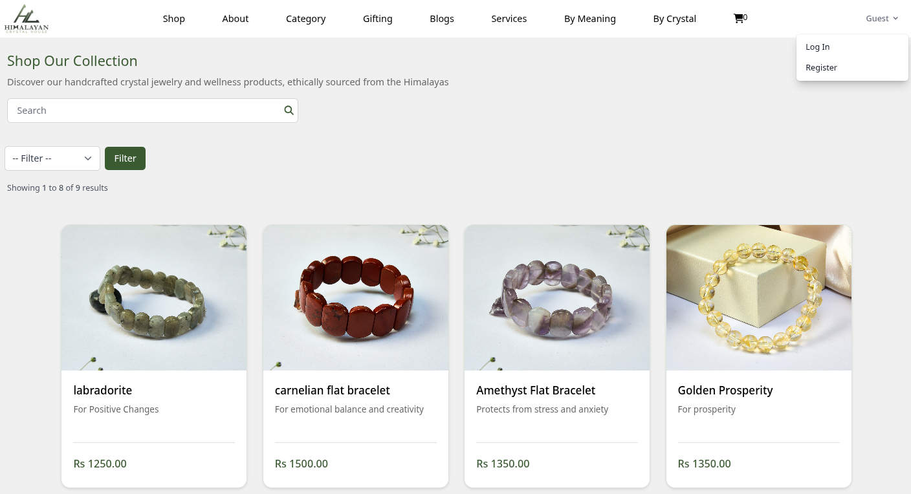
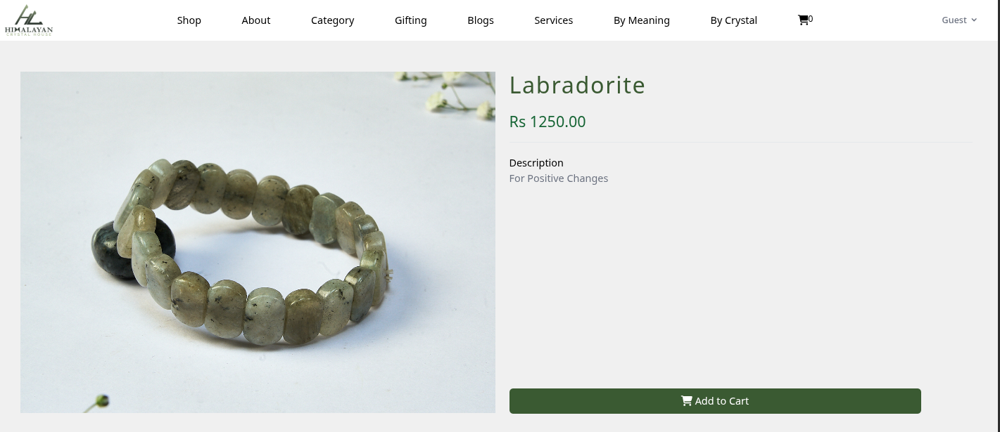
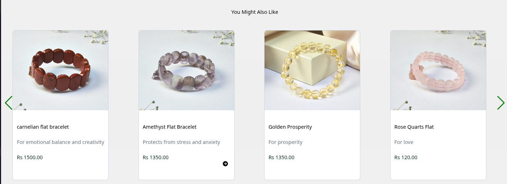
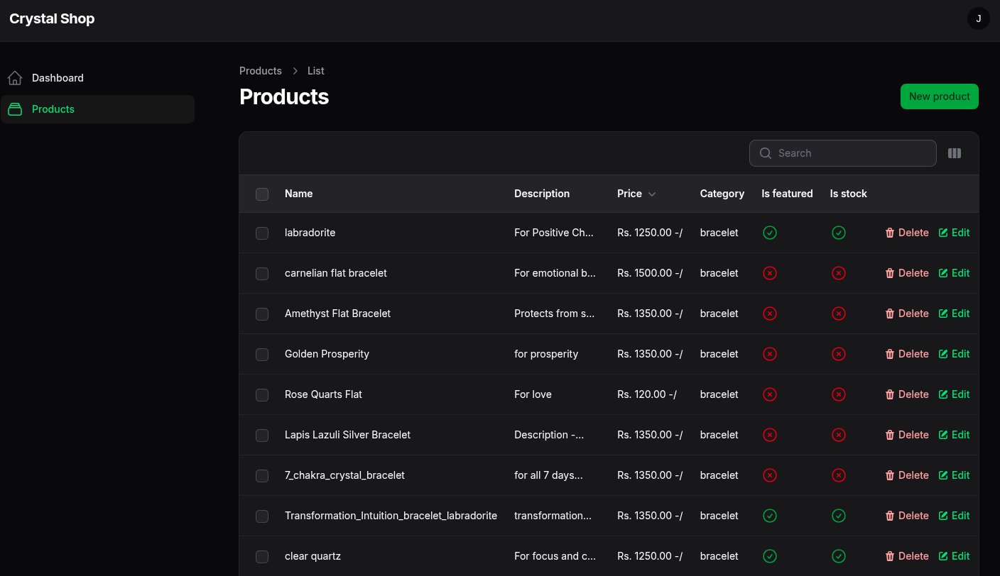

# crystal-shop 

> 🚧 **Status: In Progress** — building. Not done.

A simple e-commerce app made in laravel which let's user to browse through the products (which are bracelets which gems). The project is till on going on, it's not completed yet. 

## Products Page

## Single Products Page (still working on it)

## Options to choose from 

## Admin Panel


## 🚀 Features
- Breeze Authentication (Login/Register/Password Reset)
- Product Listing
- Product Details
- Category Filtering
- Cart System (still working on it)
- Checkout Flow (still working on it)
- Order Management (still working on it)
- Admin Panel (still working on it)
- Responsive Design 
- Eloquent ORM

*(list updates as built)*
---
## 🛠 Tech Stack
- Laravel
- Blade
- Laravel Breeze (Auth)
- Tailwind CSS
- MySQL
- Vite
- Composer
---
## ⚙️ Installation

### 1. Clone
```bash
git clone https://github.com/jenous11/crystal-shop.git
```

### 2. Install Dependencies
```bash
composer install
npm install
```

### 3. Setup Env

Linux/Mac:
```bash
cp .env.example .env
```

Windows (cmd):
```bash
copy .env.example .env
```

Then:
```bash
php artisan key:generate
```

Edit `.env`:
```bash
DB_CONNECTION=mysql
DB_HOST=127.0.0.1
DB_PORT=3306
DB_DATABASE=crystal_shop
DB_USERNAME=root
DB_PASSWORD=
```

### 4. Migrate & Seed
```bash
php artisan migrate --seed
```

### 5. Build Assets
```bash
npm run build
```

### 6. Run
```bash
php artisan serve
npm run dev
```

Open:
```bash
http://localhost:8000
```
---
##  Database Schema

### Categories Table
```php
Schema::create('categories', function (Blueprint $table) {
    $table->id();
    $table->string('name');
    $table->timestamps();
});
```

### Products Table
```php
Schema::create('products', function (Blueprint $table) {
    $table->id();
    $table->string('name');
    $table->text('description');
    $table->decimal('price', 8, 2);
    $table->string('image')->nullable();
    $table->foreignId('category_id')->constrained();
    $table->boolean('is_featured')->default(false);
    $table->boolean('is_stock')->default(true);
    $table->timestamps();
});
```

### Relationships
- `Category` **hasMany** `Product`
- `Product` **belongsTo** `Category`
---
## 📂 Project Structure
```bash
crystal-shop/
│
├── app/
│   ├── Models/
│   │   ├── Category.php
│   │   └── Product.php
├── bootstrap/
├── config/
├── database/
│   ├── migrations/
├── public/
├── resources/
├── routes/
├── storage/
├── tests/
├── vendor/
├── .env.example
├── .gitignore
├── artisan
├── composer.json
├── composer.lock
├── package.json
├── package-lock.json
├── phpunit.xml
├── postcss.config.js
├── tailwind.config.js
├── vite.config.js
└── README.md
```
---
## 🔒 Security
- Laravel Breeze Auth
- CSRF Protection
- Eloquent (SQL injection safe)
- Hashed Passwords
---
## 📌 TODO
- [ ] Cart & Checkout
- [ ] Order Model & Migration
- [ ] Payment Integration
- [ ] Wishlist
- [ ] Reviews
- [ ] Order Tracking
